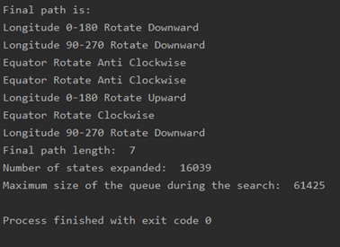

# Hungarian_Globe

## Description
The puzzle given is a Hungarian globe with three axes of rotation, each having 12 tiles. The three axes are perpendicular to each other. The initial state of the globe and the final state are given in the input files. These files define the co-ordinate values for all the 30 tiles on the globe. Looking at these values, the heuristic that has been constructed is the Manhattan distance between the current state that the globe is in and the goal state.

At each state of the globe, there can be 6 different operations that can be done on the three different axes. Let us the call the equator as “equator”, one of the longitudes as “longitude 0-180” and the other longitude as “longitude 90-270”. The following operations can be performed at each step of the expansion of the states:

Equator rotation – clockwise direction
Equator rotation – anticlockwise direction
Longitude 0-180 – clockwise rotation
Longitude 0-180 – anticlockwise rotation
Longitude 90-270 – clockwise rotation
Longitude 90-270 – anticlockwise rotation

Each of the operations shift the coordinates to the right or left by 1 position.

The heuristic is calculated as the Manhattan distance of each co-ordinate between the current state and the target state. At each point, the distance can be calculated in more than one way. All these distances are computed and the least among them is put into another array. All these distances are then summed up and then divided by 10 to get the heuristic value for the distance. The sum is divided by 15 since the total number of distances computed is 30 and the distances of at least two co-ordinates in the 30 tiles will be equal since the globe is symmetric along all the three axes. This distance is taken to avoid both overestimation and underestimation. For this value, the level of the node is added so that, when the distance determined is the same for child states and the sibling states, the sibling is considered.
The heuristic function is mathematically represented as:  
**H(current state) = sum(Manhattan distance of each point)/10 + level of the state**

To calculate the distances, the layout of the globe is hard coded with the index values of the ideal position of the globe. All the distances are measured using the hard coded values. The hard coded values for the ideal globe state are given as follows:

Longitude 0-180 axis:
| Co – ordinate | Index |
| --- | --- |
| (0, 0) | 0 |
| (30, 0) | 1 |
| (60, 0) | 2 |
| (90, 0) | 3 |
| (120, 0) | 29 |
| (150, 0) | 28 |
| (180, 180) | 23 |
| (150, 180) | 24 |
| (120, 180) | 25 |
| (90, 180) | 9 |
| (60, 180) | 26 |
| (30, 180) | 27 |

Equator axis:
| Co – ordinate | Index |
| --- | --- |
| (90, 0) | 3 |
| (90, 30) | 4 |
| (90, 60) | 5 |
| (90, 90) | 6 |
| (90, 120) | 7 |
| (90, 150) | 8 |
| (90, 180) | 9 |
| (90, 210) | 10 |
| (90, 240) | 11 |
| (90, 270) | 12 |
| (90, 300) | 13 |
| (90, 330) | 14 |

Longitude 90-270 axis:
| Co – ordinate | Index |
| --- | --- |
| (0, 0) | 0 |
| (30, 90) | 18 |
| (60, 90) | 17 |
| (90, 90) | 6 |
| (120, 90) | 16 |
| (150, 90) | 15 |
| (180, 180) | 23 |
| (150, 270) | 22 |
| (120, 270) | 21 |
| (90, 270) | 12 |
| (60, 270) | 20 |
| (30, 270) | 19 |

Since there are three axes, there are 6 intersection points. They are {(0,0): 0, (90,0): 3, (90,90):  6, (90,180):  9, (90,270): 12, (180,180): 23}

## Results
In order to examine the heuristic, the program was run for the 10 path files give. The following results were obtained:
| File | Heuristic value from initial state to target state (without the level) |
| --- | --- |
| PathN-1.mb | 0.8 |
| PathN-2.mb | 1.6 |
| PathN-3.mb | 2.4 |
| PathN-4.mb | 1.86666666667 |
| PathN-5.mb | 2.66666666665 |
| PathN-6.mb | 3.73333333334 |
| PathN-7.mb | 4.53333333333 |
| PathN-8.mb | 2.4 |
| PathN-9.mb | 3.46666666667 |
| PathN-10.mb | 6.53333333333 |

The above heuristic is **consistent** in that, the distance return from the heuristic always decreases as and when the states move closer and closer to the goal state, that is, the distance of the initial state to the goal state is the highest and when this state is expanded using the rotations, the distance of the resulting state is lesser than that of the parent. Although this is true, it is not necessary that the children of one state have lesser heuristic than the siblings of the state.
The above heuristic is **admissible** since the value of the heuristic returned is always lesser than the actual distance that is required to complete the puzzle. Therefore, the above heuristic can be used to deduce the estimation for the A Star search algorithm.

### Breadth First Search:
The Breadth first algorithm written runs till “PathN-9.mb”. It runs the file in 15 minutes. The “PathN-10.mb” does not run to completion as it encounters MemoryError after 12,50,000 iterations. The following results were obtained by the algorithm for some of the puzzles which had the path from 1 to 9.

**Sample output for BFS**

**Stats:**  
Minimum number of states expanded = 5102  
Maximum number of states expanded = 63645  
Average number of states expanded = 26655  
The maximum queue size = 241789  

### A Star Search:
The A-Star Search algorithm written runs fine for all the path files. It takes about 4 minutes to run the PathN-10.mb file. The following results were obtained when the puzzle files were run.

**Sample output for A star**

**Stats:**
Minimum number of states expanded = 94  
Maximum number of states expanded = 35867  
Average number of states expanded = 6870  
The maximum queue size = 135775  

## Conclusion
From the above statistics it can be seen that the number of states and the maximum queue length significantly decreases from BFS to A Star. In conclusion, the best algorithm to use for this problem is the A Star search algorithm.

## Execution
The implementation is written in a single file called Search.py. This file is a Python-3.6 file which contains the implementation of Breadth First Search and A Star Search for the given Hungarian Globe puzzle. The code can be executed from the command prompt as:  
**Breadth first search:** `python Search.py BFS \<File name\>`  
**A Star search:** `python Search.py AStar \<File name\>`  

### Data
The data is given in a separate folder called data. In order to execute the program successfully, these files must be in the same folder as the python file.
